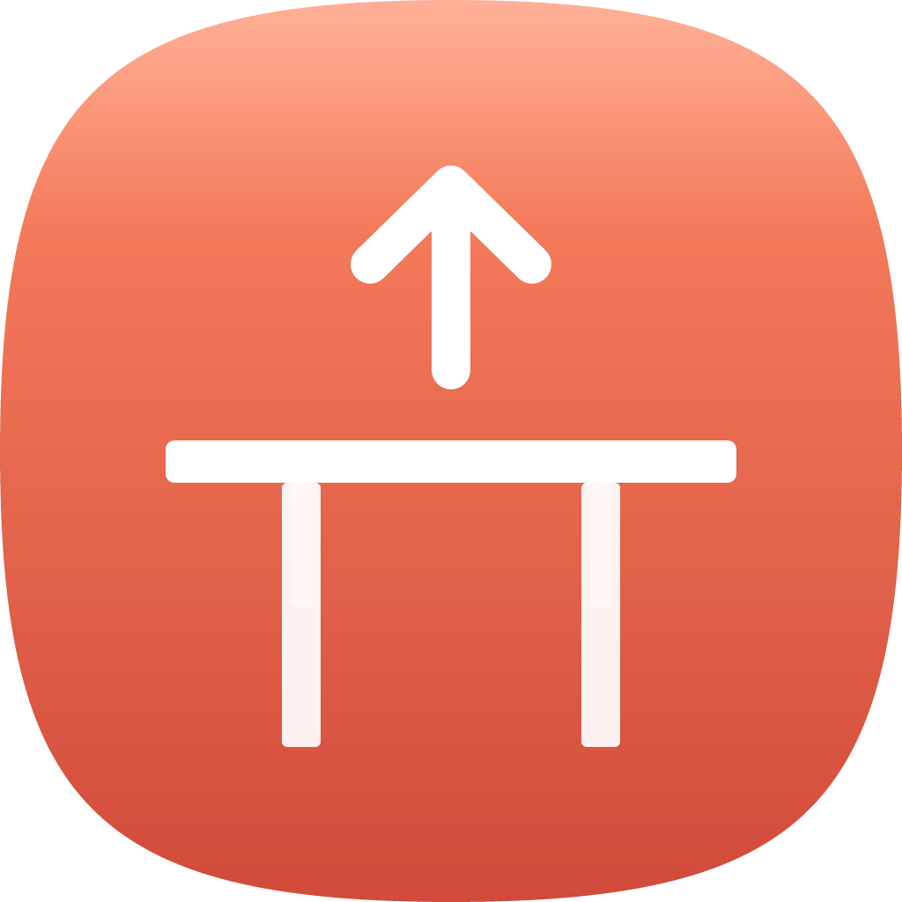

<div align="center">
  

  # OpenDesk

  **Control your Linak standing desk from the menu bar.**

  No phone app, no remote, no friction — just a tap to sit or stand.

  [](https://github.com/erenkan/opendesk/actions/workflows/ci.yml)
  [](LICENSE)
</div>

## Download

[**Download the latest release**](https://github.com/erenkan/opendesk/releases/latest) — macOS (Apple Silicon & Intel) and Linux.

The macOS build is Developer ID-signed + notarized and **auto-updates** from
GitHub Releases. Install once and you're set.

## What It Does

OpenDesk lives in your menu bar and talks to Linak DPG1C-class desks over
Bluetooth LE. Tap, hold, or hit a preset — your desk responds.

- **One click to sit or stand.** Custom presets with editable heights and labels.
- **Hold-to-move arrows.** Fine-grained adjustment without leaving the panel.
- **Live height readout.** cm or inches — your choice.
- **Stand reminder.** Native desktop notification on your interval (1–240 min, fully customizable).
- **Survives sleep/wake.** Backend watchdog reconnects automatically when CoreBluetooth drops the link.
- **Tray-only.** No Dock icon on macOS, no taskbar entry on Linux.

## Compatible Desks

| Brand / model       | Status       | Notes                                              |
|---------------------|--------------|----------------------------------------------------|
| Linak DPG1C         | ✅ verified  | Reference implementation                           |
| IKEA Idasen         | ✅ verified  | Linak-compatible firmware                          |
| Other Linak OEMs    | 🧪 likely    | Worth trying; open an issue if name matching fails |
| JIECANG / Flexispot | ❌ not yet   | Needs protocol module — PRs welcome                |
| Uplift / Desky      | ❌ not yet   | Needs protocol module — PRs welcome                |

`✅ verified` = tested on real hardware by a maintainer.
`🧪 likely` = same chipset family, should work; unconfirmed.
`❌ not yet` = different BLE protocol, no module exists.

Want a desk that's not listed?
[Open a request.](https://github.com/erenkan/opendesk/issues/new/choose)

## Permissions

On first launch macOS prompts for Bluetooth access. If you deny it and change
your mind, grant it again at **System Settings → Privacy & Security → Bluetooth
→ OpenDesk**. Without permission, scans return an empty list silently —
OpenDesk surfaces a toast after 10 s if no peripherals appear.

Linux: user must be in the `bluetooth` group; GNOME also needs the
`gnome-shell-extension-appindicator` extension for the tray icon to render.

## Platform requirements

| Platform | Minimum |
|----------|---------|
| macOS    | 11 Big Sur |
| Linux    | BlueZ 5.50+, user in the `bluetooth` group |

## Contributing

PRs welcome — especially new desk-protocol modules. The architecture is
documented in [`src-tauri/src/ble/manager.rs`](src-tauri/src/ble/manager.rs)
(state machine + move-loop) and [`src/hooks/useDesk.ts`](src/hooks/useDesk.ts)
(IPC subscription). Protocol details live in
[`src-tauri/src/ble/linak.rs`](src-tauri/src/ble/linak.rs), which is pure and
unit-tested.

Start with a [New desk brand](.github/ISSUE_TEMPLATE/new-desk.yml) issue to
share the protocol research first (service UUID, command bytes, position
encoding, handshake if any); then a PR touches:

- `src-tauri/src/ble/<brand>.rs` — new protocol module, mirror `linak.rs`'s shape
- `src-tauri/src/ble/mod.rs` — `pub mod <brand>;`
- `src-tauri/src/ble/manager.rs::find_desk` — add name / service-UUID matcher
- Unit tests in the new module: encode/decode round-trip, boundary clamping
- The compatibility table above — a row for your desk

## License

[MIT](LICENSE)

---

<details>
<summary><strong>Build from source</strong></summary>

### Stack

Tauri v2 (Rust) backend + React/TypeScript frontend, Tailwind 4 for styling,
[`btleplug`](https://github.com/deviceplug/btleplug) for cross-platform BLE,
[`tauri-nspanel`](https://github.com/ahkohd/tauri-nspanel) for the macOS NSPanel
popover.

### Prerequisites

Rust (stable, 1.77+), Node 18+, pnpm, and the Tauri system dependencies for
your OS — see <https://v2.tauri.app/start/prerequisites/>.

macOS contributors editing the app icon additionally need Xcode (for `actool`)
and [Icon Composer](https://developer.apple.com/icon-composer/) to regenerate
`src-tauri/icons/AppIcon.icon`.

### Run

```bash
pnpm install
pnpm tauri dev        # hot-reload dev build
```

On macOS 26 Tahoe (Darwin 25+) the raw binary panics during launch
([tao#1171](https://github.com/tauri-apps/tao/issues/1171)). Use the bundled
`.app` for day-to-day testing:

```bash
pnpm app:rebuild      # kill running, rebuild, register, launch .app
pnpm app:logs         # tail backend log at ~/Library/Logs/app.opendesk.menubar/
```

### Scripts

| Script | What it does |
|--------|---------------|
| `pnpm dev` | Vite dev server only (no Tauri) |
| `pnpm build` | `tsc && vite build` — production web bundle |
| `pnpm tauri dev` | Tauri dev window + hot reload |
| `pnpm app:rebuild` | Kill, rebuild, re-register, relaunch `.app` (includes `mac:icon`) |
| `pnpm app:logs` | Tail the backend log file |
| `pnpm icons` | Re-render `icon.svg`/`tray-icon.svg` → PNGs → Tauri icon fan-out |
| `pnpm mac:icon` | Compile `AppIcon.icon` via `actool`, inject `Assets.car` into the debug bundle, patch `Info.plist` (Liquid Glass pipeline — macOS-only, no-op elsewhere) |
| `pnpm mac:icon:release` | Same for the release-profile bundle |

### Project layout

```
src/                     # React/TypeScript frontend
  components/popover/    # Popover UI (NSPanel on macOS, window elsewhere)
  hooks/                 # React hooks (useDesk, useAutoSession, ...)
  lib/                   # IPC wrapper, constants, presets
src-tauri/
  src/
    ble/                 # BLE state machine + Linak protocol
    commands.rs          # #[tauri::command] pass-throughs
    events.rs            # Event payloads (stays in sync with src/lib/desk.ts)
    notification.rs      # macOS UNUserNotificationCenter delivery (with icon attachment)
    panel.rs             # macOS NSPanel setup + tray-relative positioning
    reminder.rs          # Stand reminder tokio task
    state.rs             # AppState + reconnect watchdog
    tray.rs              # Tray icon + menu + click handler
  icons/                 # Master SVGs + generated PNG/ICNS/ICO
    AppIcon.icon/        # Icon Composer source for macOS 26 Liquid Glass
  capabilities/          # Tauri v2 capability manifests
scripts/
  render-icons.mjs       # SVG → PNG via @resvg/resvg-js
  mac-compile-icon.sh    # actool (`.icon` → Assets.car) + Info.plist patch
```

### Known issues

- **macOS sleep/wake**: CoreBluetooth disconnects silently on system sleep
  without firing `didDisconnectPeripheral`. The watchdog in
  `state.rs::run_reconnect_loop` polls `is_connected()` every 5 s and
  reconnects automatically when the link goes stale.
- **First-connect on macOS**: the initial scan may take up to 12 s if the
  desk controller is idle. Subsequent reconnects use a cached handle and
  complete in ~1 s.
- **macOS 26 Tahoe Liquid Glass icon** is built via a local workaround
  (`scripts/mac-compile-icon.sh` wraps `actool`) because Tauri ≤ 2.10.1
  can't bundle `.icon` files yet. Native support is merged upstream
  ([tauri-apps/tauri#14207](https://github.com/tauri-apps/tauri/issues/14207))
  but unreleased as of 2026-04. Once shipped, drop the script and add
  `icons/AppIcon.icon` to `tauri.conf.json`'s `bundle.icon` array.
- **macOS notifications**: `tauri-plugin-notification` uses the deprecated
  `NSUserNotification` API which drops the bundle icon on LSUIElement apps.
  We route reminders through our own `send_native_notification` command
  (`UNUserNotificationCenter` + `UNNotificationAttachment`) on macOS.
  Non-macOS keeps the plugin path.
- **Linux GNOME**: without the AppIndicator extension the tray icon is
  invisible. Install it separately.

</details>
